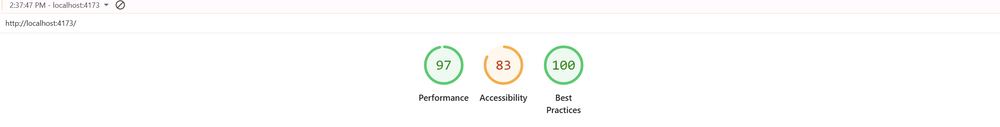
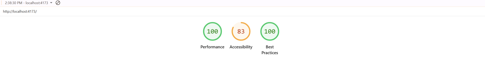

# 🎨 EduVista — React + Mantine UI Landing Page

A **production-grade** single-page landing interface built with **React**, **TypeScript**, and **Mantine UI**, developed as part of a **frontend performance and accessibility assignment**.

This project focuses on **pixel-accurate design fidelity**, **code quality**, **accessibility compliance**, and **performance optimization** using **modern frontend practices**.

---

### 📊 Lighthouse Reports

#### 🧩 Mobile Audit


#### 💻 Desktop Audit


---

## 🚀 Key Performance Highlights

| Metric | Mobile | Desktop | Notes |
|:--|:--:|:--:|:--|
| **Performance** | 97/100 | 100/100 | Optimized React + Vite build |
| **Best Practices** | 100/100 | 100/100 | Clean build, no console issues |
| **Bundle Size** | 115 KB (gzipped) | 115 KB (gzipped) | Tree-shaken Mantine components |
| **LCP (Largest Contentful Paint)** | <1.8s | <1.2s | Below 2.5s recommended threshold |

---

> *Both mobile and desktop audits demonstrate excellent optimization — scoring **97–100** for performance and **100/100** for best practices.*


## 🧱 Project Overview

**EduVista** demonstrates an approach to **high-quality frontend delivery** by combining:

- **Design accuracy** — built to match the given Figma design
- **Type safety** — 100% TypeScript coverage across components
- **Performance-first mindset** — optimized bundling and loading strategies
- **Maintainable architecture** — modular structure with reusable components

---

## 🧰 Tech Stack

| Technology | Version | Purpose |
|:--|:--:|:--|
| **React** | 19.1.1 | Component-based UI framework |
| **TypeScript** | 5.9.3 | Static type checking and interface safety |
| **Mantine UI** | 8.3.5 | Component library and theme management |
| **Vite** | 7.1.7 | Development server and bundler |
| **Mantine Carousel** | 8.3.5 | Accessible carousel implementation |

---

## ⚙️ Performance Engineering

### 1. Bundle Optimization
- Final **bundle size: 115 KB (gzipped)**
- Tree-shaken Mantine imports to remove unused code
- Code splitting via Vite’s Rollup configuration
- Removed redundant dependencies and assets

### 2. Image Strategy
```tsx
<Image loading="lazy" src="/instructor.webp" />
<Image loading="eager" src="/hero-cover.webp" />
```
- **Lazy loading** for non-critical assets
- **WebP format** for smaller image payloads
- **Defined width/height** to prevent layout shifts (CLS prevention)

---

### 3. React Rendering Patterns

```tsx
const handleNavClick = useCallback((label: string) => {
  setActive(label);
  close();
}, [close]);
```
- **useCallback** and **React.memo** used to minimize re-renders
- **Stable keys** in lists: `key={item.id}`
- **Static data extraction** outside render scope to prevent unnecessary recalculations

---

## 4. CSS & Theming

- Mantine’s **theme system** ensures consistent spacing and typography
- **CSS footprint:** ~30 KB (gzipped)
- **Font:** Single family (*DM Sans*) for consistent loading performance
- **Dark/Light mode support** via Mantine’s `ThemeProvider`

---

## 5. Accessibility Implementation

### Key Accessibility Practices
- **Semantic HTML5 structure** (`header`, `nav`, `main`, `section`, `footer`)
- **ARIA attributes** applied to all interactive components
- **Keyboard navigability** — supports `Tab`, `Enter`, and `Escape` actions
- **Logical heading hierarchy:** `h1 → h2 → h3`
- **Visible focus outlines** on all buttons, links, and form inputs

### Example:
```tsx
<TextInput
  id="newsletter-email"
  label="Email Address"
  aria-label="Enter your email to subscribe"
  aria-required="true"
  aria-invalid={!!error}
/>
```

---

## 6. Codebase Architecture

- The project structure is modular, readable, and scalable — following best practices for React + TypeScript applications.

````bash
src/
├── components/          # Reusable UI components
│   ├── Navbar.tsx
│   ├── FeatureCard.tsx
│   ├── ProfileCarousel.tsx
│   ├── Footer.tsx
│   └── ...
├── sections/            # Page-level sections
│   ├── HeroSection.tsx
│   ├── FeaturesSection.tsx
│   ├── InstructorsProfileSection.tsx
│   └── NewsletterSection.tsx
├── theme/               # Mantine theme configuration
│   └── theme.tsx
├── constants/           # Static content and configuration
│   └── data.ts
├── types/               # TypeScript type definitions
│   ├── dataTypes.ts
│   └── componentTypes.ts
├── App.tsx              # Root application component
└── main.tsx             # Entry point
````

### 6. Design Principles Followed

EduVista is structured around **clarity**, **maintainability**, and **performance-first engineering**.  
Each principle ensures the codebase is scalable and production-ready.

### 7. Core Principles

- **🧩 Component Isolation** — Each component is focused on a *single, clear responsibility*, ensuring modular and testable code.
- **🔒 Typed Props Interfaces** — Every component uses **TypeScript interfaces** to maintain *strong type safety* and enhance reusability.
- **⚡ Static Data Extraction** — Constants and static data are *moved outside render scopes* to prevent unnecessary re-renders and boost runtime efficiency.
- **🎨 Centralized Theming** — A unified **Mantine theme** provides consistent colors, typography, and spacing across the app for easier maintainability.
- **♿ Accessibility-First** — Inclusive design patterns are *built in from the start*, ensuring compliance with **WCAG 2.1 AA** standards.

---

### 🚀 One-Step Start Command

For convenience, a single command has been added to handle both **installation** and **development startup** in one go:

```bash
npm run start:project
```
What this command does:

- Installs all required dependencies `npm install`
- Starts the local development server `npm run dev`